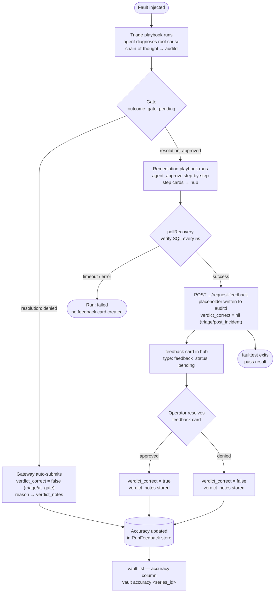

# aiHelpDesk Decision Hub

The Decision Hub is a unified surface that aggregates every pending human decision across all aiHelpDesk subsystems. [Playbook](PLAYBOOKS.md) gates, [Fleet](FLEET.md) approvals and per-step [agent approvals](PLAYBOOKS.md#approval-modes). All of that goes into a single list with a single resolve endpoint. Operators get one place to look. Webhooks and email fire for all types.

---

## Decision types

| Type | Prefix | Raised by | Raised when |
|---|---|---|---|
| `gate` | `gate:{runID}` | Gateway | Triage playbook completes and `gate_escalation=true`; `TRANSITION_TO` or `ESCALATE_TO` signal present and `recommended` is actionable |
| `fleet_approval` | `fleet:{approvalID}` | fleet-runner | Job contains write or destructive steps and requires top-level approval |
| `step_approval` | `step:{approvalID}` | Gateway | `agent_approve` playbook reaches a write/destructive step |
| `feedback` | `feedback:{runID}` | faulttest (`--emit-and-wait`) | Recovery verified after a gate-escalation run; operator has not yet confirmed or denied the diagnosis |

Gates have two sub-types, reflected in `extra.gate_type`:

| `gate_type` | Signal | What it means |
|---|---|---|
| `transition` | `TRANSITION_TO:` | Triage handing off to its expected remediation counterpart within the same problem domain (e.g. `pbs_vacuum_triage` → `pbs_vacuum_remediate`). Routine pipeline step. |
| `escalation` | `ESCALATE_TO:` | True cross-domain handoff to a different agent or domain (e.g. DB agent → SysAdmin agent). May warrant closer operator scrutiny. |

### Gate `extra` fields

| Field | Always present | Description |
|---|---|---|
| `gate_type` | Yes | `"transition"` or `"escalation"` |
| `findings` | Yes | Triage summary text emitted by the agent |
| `transition_target` / `escalation_target` | Yes (one of) | Series ID of the next playbook |
| `confidence_warning` | When confidence < 70% | Advisory; describes the primary hypothesis confidence level |
| `suggested_approval_mode` | When `confidence_warning` present | Suggested mode for remediation (`"manual"` etc.) |
| `remediation_preview` | When next playbook is resolvable | Object: `series_id`, `name`, `description`, `approval_mode` of the planned remediation playbook |
| `diagnostic_report` | When triage emits `HYPOTHESIS_N:` lines | Structured diagnosis: `hypotheses[]` (each with `rank`, `text`, `confidence`, `is_primary`, `evidence`, `rejected_reason`), `root_cause` |
| `gate_reason` | When gate was forced by the gateway | `"low_confidence"` — primary hypothesis confidence was below 50%; gate fired automatically even without `gate_escalation=true` |

`remediation_preview` lets operators see exactly what remediation will do — its name, intent, and default approval mode — before clicking approve. `diagnostic_report` records the structured reasoning behind the triage conclusion for later audit review. `gate_reason: "low_confidence"` signals that the gate was not requested by the caller but enforced by the gateway because the diagnosis did not reach the 50% confidence threshold required to auto-chain into remediation.

### Feedback `extra` fields

| Field | Always present | Description |
|---|---|---|
| `run_id` | Yes | The triage run ID this feedback request is anchored to |
| `series_id` | Yes | The triage playbook series ID (e.g. `pbs_lock_chain_triage`) |
| `verdict_correct` | Only when resolved | `true` if the operator confirmed the diagnosis; `false` if denied |
| `verdict_notes` | When provided at resolve time | Free-text description of what the root cause actually was |

---

## Listing pending decisions

```
GET /api/v1/decisions
```

Returns all pending decisions across all types, sorted newest-first.

**Query parameters:**

| Parameter | Default | Description |
|---|---|---|
| `status` | `pending` | Filter by status: `pending`, `approved`, `denied`, `expired`, `abandoned` |
| `type` | _(all)_ | Filter by type: `gate`, `fleet_approval`, `step_approval`, `feedback` |
| `limit` | `50` | Maximum results |

**Example:**

```bash
curl http://localhost:8080/api/v1/decisions | jq .
```

```json
{
  "decisions": [
    {
      "id":           "gate:plr_a3f7c1b2",
      "type":         "gate",
      "status":       "pending",
      "summary":      "Triage complete — TRANSITION_TO pbs_vacuum_remediate",
      "requested_by": "alice",
      "requested_at": "2026-06-01T14:23:01Z",
      "resolve_url":  "POST https://helpdesk.internal/api/v1/decisions/gate:plr_a3f7c1b2/resolve",
      "extra": {
        "gate_type":         "transition",
        "transition_target": "pbs_vacuum_remediate",
        "findings":          "Table public.orders has 94% dead tuple ratio...",
        "series_id":         "pbs_vacuum_triage",
        "remediation_preview": {
          "series_id":     "pbs_vacuum_remediate",
          "name":          "Vacuum Remediation",
          "description":   "Run VACUUM ANALYZE on the bloated table and verify dead tuple ratio drops below 20%.",
          "approval_mode": "review"
        }
      }
    },
    {
      "id":           "gate:plr_b8e2d4f1",
      "type":         "gate",
      "status":       "pending",
      "summary":      "Triage complete — ESCALATE_TO pbs_sysadmin_docker_inspect",
      "requested_by": "bob",
      "requested_at": "2026-06-01T13:11:45Z",
      "resolve_url":  "POST https://helpdesk.internal/api/v1/decisions/gate:plr_b8e2d4f1/resolve",
      "extra": {
        "gate_type":          "escalation",
        "escalation_target":  "pbs_sysadmin_docker_inspect",
        "findings":           "Connection refused — Docker-level investigation needed.",
        "series_id":          "pbs_connection_triage",
        "confidence_warning": "Primary hypothesis confidence 55%",
        "remediation_preview": {
          "series_id":     "pbs_sysadmin_docker_inspect",
          "name":          "Docker Container Inspect",
          "description":   "Inspect the database container for OOM kills, crash loops, or misconfig.",
          "approval_mode": "manual"
        },
        "diagnostic_report": {
          "hypotheses": [
            {
              "rank": 1, "text": "Container OOM-killed by cgroup memory limit",
              "confidence": 0.55, "is_primary": true,
              "evidence": "dmesg: oom-kill event, constraint=CONSTRAINT_MEMCG"
            },
            {
              "rank": 2, "text": "Network policy blocking pod-to-pod traffic",
              "confidence": 0.30, "is_primary": false,
              "rejected_reason": "connection refused rather than timeout"
            }
          ],
          "root_cause": "Container OOM-killed by cgroup memory limit"
        }
      }
    }
  ],
  "total": 2
}
```

A `feedback` decision looks like this:

```json
{
  "id":           "feedback:plr_a3f7c1b2",
  "type":         "feedback",
  "status":       "pending",
  "summary":      "Diagnosis feedback needed — pbs_lock_chain_triage",
  "requested_by": "faulttest",
  "requested_at": "2026-06-01T14:31:05Z",
  "resolve_url":  "POST https://helpdesk.internal/api/v1/decisions/feedback:plr_a3f7c1b2/resolve",
  "extra": {
    "run_id":    "plr_a3f7c1b2",
    "series_id": "pbs_lock_chain_triage"
  }
}
```

Once resolved, `extra` gains `verdict_correct` and, if provided, `verdict_notes`.

---

## Resolving a decision

```
POST /api/v1/decisions/{id}/resolve
```

The `{id}` prefix determines routing:

| Prefix | Routes to | Notes |
|---|---|---|
| `gate:{runID}` | Playbook `proceed-escalation` endpoint | Triggers the remediation playbook on approval |
| `fleet:{approvalID}` | Fleet approval in the audit store | |
| `step:{approvalID}` | Step approval in the audit store | |
| `feedback:{runID}` | Playbook feedback endpoint | `approved` → `verdict_correct=true`; `denied` → `verdict_correct=false` |

**Request body:**

```json
{
  "resolution":       "approved",
  "resolved_by":      "alice",
  "reason":           "Findings look correct, proceed with manual review",

  // Gate-specific (ignored for other types):
  "approval_mode":    "review",
  "approval_session": ""
}
```

| Field | Description |
|---|---|
| `resolution` | `"approved"` or `"denied"` |
| `resolved_by` | Operator identity; defaults to `X-User` header if omitted |
| `reason` | Optional free-text; for gates it is stored in the audit trail; for feedback it becomes `verdict_notes` |
| `approval_mode` | Gate only: approval mode for the triggered remediation playbook |
| `approval_session` | Gate only: session token when `approval_mode=session` |

**Examples:**

```bash
# Approve a gate
curl -X POST http://localhost:8080/api/v1/decisions/gate:plr_a3f7c1b2/resolve \
  -H "Content-Type: application/json" \
  -d '{"resolution": "approved", "resolved_by": "alice", "approval_mode": "review"}'

# Deny a fleet approval
curl -X POST http://localhost:8080/api/v1/decisions/fleet:apr_c8d2e1f4/resolve \
  -H "Content-Type: application/json" \
  -d '{"resolution": "denied", "resolved_by": "oncall", "reason": "Wrong maintenance window"}'

# Confirm the diagnosis was correct (feedback)
curl -X POST http://localhost:8080/api/v1/decisions/feedback:plr_a3f7c1b2/resolve \
  -H "Content-Type: application/json" \
  -d '{"resolution": "approved", "resolved_by": "alice", "reason": "Root blocker PID 236 confirmed idle-in-transaction"}'

# Deny — diagnosis was wrong (feedback)
curl -X POST http://localhost:8080/api/v1/decisions/feedback:plr_a3f7c1b2/resolve \
  -H "Content-Type: application/json" \
  -d '{"resolution": "denied", "resolved_by": "alice", "reason": "Actual cause was autovacuum lock, not idle-in-transaction"}'
```

---

## Notifications

The Decision Hub fires a notification whenever a decision is created or resolved. Configure via environment variables:

| Variable | Description |
|---|---|
| `HELPDESK_DECISION_WEBHOOK` | Webhook URL for all decision events (generic JSON or Slack incoming webhook) |
| `HELPDESK_DECISION_WEBHOOK_SECRET` | HMAC-SHA256 key; adds `X-Helpdesk-Signature: sha256=<hex>` header |
| `HELPDESK_BASE_URL` | Gateway public URL; used to build absolute `resolve_url` links in notifications |
| `HELPDESK_SMTP_HOST` / `PORT` / `USER` / `PASSWORD` | SMTP server for email notifications |
| `HELPDESK_EMAIL_FROM` | Sender address |
| `HELPDESK_EMAIL_TO` | Comma-separated recipient list |

### Webhook payload

All events use the same payload shape:

```json
{
  "event":        "decision_pending",
  "decision_id":  "gate:plr_a3f7c1b2",
  "type":         "gate",
  "status":       "pending",
  "summary":      "Triage complete — TRANSITION_TO pbs_vacuum_remediate",
  "requested_by": "alice",
  "resolve_url":  "POST https://helpdesk.internal/api/v1/decisions/gate:plr_a3f7c1b2/resolve",
  "extra":        { "gate_type": "transition", "transition_target": "pbs_vacuum_remediate", "findings": "..." },
  "timestamp":    "2026-06-01T14:23:01Z"
}
```

`event` is `decision_pending` on creation and `decision_resolved` on approval/denial. For escalation gates, `extra.gate_type` is `"escalation"` and the target field is `escalation_target` instead of `transition_target`.

### Slack detection

If `HELPDESK_DECISION_WEBHOOK` contains `slack.com`, the payload is automatically wrapped in Slack's `attachments` format with colour coding:
- Yellow — `pending`
- Green — `approved`
- Red — `denied`, `abandoned`, `expired`

### HMAC signing

When `HELPDESK_DECISION_WEBHOOK_SECRET` is set, every outbound webhook request includes:

```
X-Helpdesk-Signature: sha256=<hex(HMAC-SHA256(body, secret))>
```

Verify on the receiving end with `hmac.Equal` to authenticate the payload.

All notification sends are non-blocking (goroutine-based); failures are logged at Warn level and never block the gateway.

---

## Relationship to type-specific endpoints

The Decision Hub is an additional surface, not a replacement. The existing endpoints remain valid:

| Type | Existing endpoint | Hub equivalent |
|---|---|---|
| Gate | `POST /api/v1/fleet/playbook-runs/{id}/proceed-escalation` | `POST /api/v1/decisions/gate:{id}/resolve` |
| Fleet approval | `PATCH {auditdURL}/v1/approvals/{id}` | `POST /api/v1/decisions/fleet:{id}/resolve` |
| Step approval | `PATCH {auditdURL}/v1/approvals/{id}` | `POST /api/v1/decisions/step:{id}/resolve` |
| Feedback | `POST /api/v1/fleet/playbook-runs/{id}/feedback` | `POST /api/v1/decisions/feedback:{id}/resolve` |

The hub routes to the same backend as the type-specific endpoint — they are interchangeable. The one exception is `feedback`: the direct endpoint accepts arbitrary `verdict_correct` values (`true`, `false`, or omitted for a placeholder), while the hub resolve endpoint maps `approved`→`true` and `denied`→`false` to fit the standard resolution model.

---

## Git webhook adapter (opt-in)

Operators can merge a specially-named branch to resolve a decision without calling the API directly. This works with any git provider that supports merge webhooks — GitHub, GitLab, Gitea, or a custom internal system.

### How it works

1. Operator creates a branch named `approved/gate/{runID}` (or `approved/fleet/{approvalID}`)
2. Operator merges the PR/MR into any target branch
3. The git provider sends a merge event to `POST /api/v1/webhooks/git`
4. The gateway extracts the branch name, maps it to a decision ID  and calls resolve

The gateway itself only needs to be reachable from the git provider — no git client is needed inside the gateway.

### Branch naming convention

| Branch | Maps to | Effect |
|---|---|---|
| `approved/gate/{runID}` | `gate:{runID}` | Approve a playbook gate |
| `approved/fleet/{approvalID}` | `fleet:{approvalID}` | Approve a fleet job |

The `approved/` prefix is configurable via `HELPDESK_GIT_RESOLVE_BRANCH` (default: `approved/`).

### Configuration

| Variable | Description |
|---|---|
| `HELPDESK_GIT_WEBHOOK_SECRET` | HMAC-SHA256 key for verifying `X-Hub-Signature-256` (GitHub/Gitea) or `X-Gitlab-Token` (GitLab). Leave empty to skip signature validation (not recommended for production). |
| `HELPDESK_GIT_RESOLVE_BRANCH` | Branch prefix that triggers resolution (default: `approved/`). |

Register the webhook endpoint in your git provider:

```
POST https://helpdesk.internal/api/v1/webhooks/git
```

The endpoint accepts all three webhook formats automatically:

| Provider | Payload format |
|---|---|
| GitHub / Gitea | `{"action":"closed","pull_request":{"merged":true,"base":{"ref":"approved/gate/..."}}}` |
| GitLab | `{"object_kind":"merge_request","object_attributes":{"state":"merged","target_branch":"approved/gate/..."}}` |
| Generic | `{"branch":"approved/gate/..."}` |

Non-merge events and non-matching branches return `200 OK` silently (no action taken).

---

## K8s and Docker — emit-and-wait

In containerised environments without a controlling terminal (`/dev/tty`), faulttest can poll the hub instead of reading from the TTY:

```bash
go run ./testing/cmd/faulttest run \
  --ids db-tx-lock-chain-blocker \
  --via-gateway --gateway http://helpdesk:8080 \
  --remediate --gate-escalation --emit-and-wait \
  --approval-mode manual \
  --audit-url http://auditd:7070
```

With `--emit-and-wait`:

- **Gate**: faulttest logs `Gate pending — resolve_url=...` and polls `GET /api/v1/fleet/playbook-runs/{id}` every 15 seconds until the gate is resolved externally. The gate appears in `GET /api/v1/decisions` as a `type=gate` card until resolved.

- **Step**: faulttest long-polls `GET {auditURL}/v1/approvals/{id}/wait` and proceeds once the operator resolves the approval via the Decision Hub or the type-specific endpoint.

- **Post-recovery feedback**: once `pollRecovery` confirms the fault has cleared, faulttest calls `POST /api/v1/fleet/playbook-runs/{runID}/request-feedback`. This creates a `feedback` decision card in the hub and prints:
  ```
  Feedback pending — resolve at:
  POST http://helpdesk:8080/api/v1/decisions/feedback:plr_a3f7c1b2/resolve
  Body: {"resolution":"approved"|"denied","resolved_by":"...","reason":"..."}
  ```
  Faulttest then exits with a pass result. The card persists in the hub until an operator answers it — there is no TTY prompt and no blocking wait. Resolving it records `verdict_correct` and contributes to the playbook's accuracy rate in the Vault.

This makes faulttest safe to run inside a Kubernetes Job or a Docker container where `/dev/tty` is not available.

---

## Life of a post-incident feedback

The path from fault injection to a confirmed accuracy signal, showing every system involved and both the gate-denial and gate-approval branches.



**Step by step:**

1. **Fault injection** — faulttest injects the fault and triggers the triage playbook via the gateway.

2. **Triage** — the LLM agent runs diagnostic tools; every reasoning step and tool call is written to auditd under the run's `trace_id`. The agent emits `TRANSITION_TO:` or `ESCALATE_TO:` with a `DiagnosticReport`. The gateway sets `outcome=gate_pending`.

3. **Gate** — a `type=gate` card appears in the hub. The operator reviews the triage findings and diagnostic report, then resolves:
   - **Denied**: the gateway immediately auto-submits `verdict_correct=false` (`feedback_type=triage`, `feedback_time=at_gate`) for the triage run, using the denial reason as `verdict_notes`. No feedback card is created — accuracy is updated at denial time and the flow ends here.
   - **Approved**: the gateway fires the remediation playbook and the flow continues.

4. **Remediation** — the `agent_approve` playbook runs step-by-step. Each write/destructive tool call appears as a `type=step_approval` card in the hub until the operator approves or the mode auto-approves it.

5. **Recovery verification** — faulttest polls the verify SQL every 5 seconds until the fault clears or the timeout elapses. On failure, the run is marked failed and no feedback card is created.

6. **Feedback request** — on successful recovery, faulttest calls `POST .../request-feedback`. The gateway writes a `RunFeedback` placeholder (`verdict_correct=nil`, `feedback_type=triage`, `feedback_time=post_incident`) to auditd. A `type=feedback, status=pending` card appears in the hub. Faulttest prints the resolve URL and exits immediately — there is no blocking wait.

7. **Operator resolves the feedback card** — at any point after the faulttest job exits, the operator opens the hub card and resolves it:
   - `resolution=approved` → the diagnosis was correct (`verdict_correct=true`)
   - `resolution=denied` → wrong hypothesis; an optional `reason` becomes `verdict_notes`

8. **Accuracy propagates** — `verdict_correct` and `verdict_notes` are persisted. `PlaybookRunStats.accuracy_rate` updates. `faulttest vault list` shows the accuracy column; `faulttest vault accuracy <series_id>` shows the per-hypothesis breakdown across all runs with feedback.

---

## Operational SRE/DBA Flywheel — fleet scenarios

See [here](VAULT.md#the-operational-sredba-flywheel) for details on aiHelpDesk Operational SRE/DBA Flywheel (and for more informal context, see [this blog post](https://medium.com/google-cloud/your-sre-on-call-runbook-is-already-obsolete-heres-why-that-s-not-your-fault-0a82b3b0183c#7fe7)). The Decision Hub is the coordination layer for all three fleet campaign scenarios:

| Scenario | Decision types involved |
|---|---|
| Fault catalog as threat model | `gate` — analyst reviews triage before each remediation playbook |
| Fleet GameDay | `gate` + `fleet_approval` — gate fires per-target; top-level approval gates the wave rollout |
| Incident-to-fleet campaign | `gate` + `fleet_approval` + `step_approval` — full review stack for production changes |

In all three cases, notifications fire automatically when a decision opens; the operator resolves via the hub, a direct API call, or a git branch merge.
