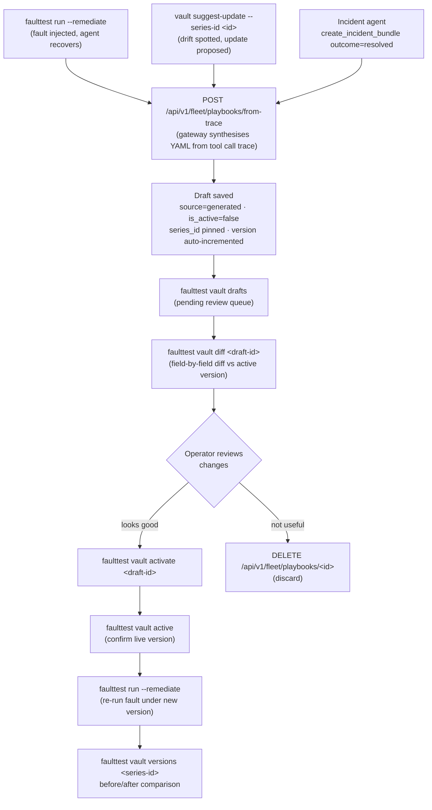

# aiHelpDesk Vault

The Vault is aiHelpDesk's institutional memory for operational knowledge. It is where every [Playbook](PLAYBOOKS.md) lives, where every [Incident](INCIDENTS.md) trace lands and where the library of known fault→remedy pairings grows. Automatically and with human approval at the gate.

A traditional runbook is a static procedure — a fixed sequence of steps written once and followed literally. An aiHelpDesk [Playbook](PLAYBOOKS.md) is fundamentally different: it encodes strategic **intent** and expert **knowledge** that the fleet planner uses to generate an execution plan dynamically, against the current state of your infrastructure and tool catalog. The same Playbook produces different steps when your database configuration differs, when new tools are available or when the environment has changed. This is what "never a stale script" means in practice.

The Vault is the library where these Playbooks live. Tracked, versioned and continuously improved as your infrastructure, applications that make use of it and agents evolve.

---

## Table of Contents

1. [The Operational SRE/DBA Flywheel](#the-operational-sredba-flywheel)
2. [How Artifacts Enter the Vault](#how-artifacts-enter-the-vault)
   - [1. System Playbooks (shipped)](#1-system-playbooks-shipped)
   - [2. The incident agent (auto-suggest on resolution)](#2-the-incident-agent-auto-suggest-on-resolution)
   - [3. faulttest auto-suggest (on remediation pass)](#3-faulttest-auto-suggest-on-remediation-pass)
3. [The Artifact Lifecycle](#the-artifact-lifecycle)
4. [Draft Review Flow](#draft-review-flow)
5. [Vault Commands](#vault-commands)
   - [vault list](#vault-list)
   - [vault accuracy](#vault-accuracy)
   - [vault incidents](#vault-incidents)
   - [vault journey](#vault-journey)
   - [vault status](#vault-status)
   - [vault drift](#vault-drift)
   - [vault versions](#vault-versions)
   - [vault calibration](#vault-calibration)
   - [vault suggest](#vault-suggest)
   - [vault suggest-update](#vault-suggest-update)
   - [vault drafts](#vault-drafts)
   - [vault diff](#vault-diff)
   - [vault activate](#vault-activate)
   - [vault active](#vault-active)
   - [vault history](#vault-history)
6. [The `from-trace` Endpoint](#the-from-trace-endpoint)
7. [Reviewing and Activating Drafts](#reviewing-and-activating-drafts)
8. [Three Customer Workflows](#three-customer-workflows)
   - [1. Onboarding — linking your first Playbooks](#1-onboarding--linking-your-first-playbooks)
   - [2. Playbook acceptance — review and approve auto-generated drafts](#2-playbook-acceptance--review-and-approve-auto-generated-drafts)
   - [3. Regression monitoring — catching drift before it becomes an incident](#3-regression-monitoring--catching-drift-before-it-becomes-an-incident)
8. [Connection to Other Docs](#connection-to-other-docs)

---

## The Operational SRE/DBA Flywheel

The Vault is the engine of a feedback loop that tightens with every incident. As such, it is also a quiantifiable **learning signal** showing how per-version metrics (step count, recovery time, remediation appropriateness) **prove** that the system is improving, not just working: [VAULT_METRICS.md](VAULT_METRICS.md)

```
  ┌────────────────────────────────────────────────────────────────────────────────┐
  │                                                                                │
  │              ┌─── CONSISTENCY GATE (pre-promotion) ──────────────┐             │
  │              │  faulttest run --repeat N                         │ STABLE      │
  │  author  ──► │  inject → diagnose → score (×N) → stability cert  │ ──────────► │
  │  Playbook    │                                 see CONSISTENCY.md│ UNSTABLE ─► │
  │              └───────────────────────────────────────────────────┘    fix      │
  │                                                                                │
  │         Fault               Agent diagnoses           Playbook                 │
  │   (injected or real) ───► + chain of thought ──────► remediates                │
  │          ▲                  captured                    │                      │
  │          │                                              │                      │
  │          │                           Operator confirms  ▼                      │
  │   Library improves  ◄── Human      ◄── diagnosis     Draft auto-saved          │
  │   (accuracy rises)      approves       correct?      to Vault                  │
  │                         (Vault review)  ↓                                      │
  │                                    accuracy_rate                               │
  │                                    feeds vault calibration                     │
  └────────────────────────────────────────────────────────────────────────────────┘
```

The loop closes at three levels: 

First, there is a **Consistency gate**: before a Playbook
enters live rotation, it is certified STABLE by running the same fault N times and verifying
that both pass rate (≥80%) and confidence spread (≤30pp) are within bounds, see [here](CONSISTENCY.md) for the full treatment. 

Second, there is a carefully tracked **Resolution rate** (does the Playbook fix the problem?). 

Third, there is an **Accuracy rate** (does the agent identify the *right* root cause?). Accuracy is measured separately from
resolution because a Playbook can achieve 100% resolution rate while the agent's diagnosis is
wrong, if the remediation step happens to fix the problem anyway. 

Distinguishing these three signals is what makes the Vault's knowledge meaningful rather than just empirically successful.

See [Life of an Incident](PLAYBOOKS.md#life-of-an-incident) for a full walkthrough of how a single incident contributes to both signals.

**Two selling points drive this loop:**

1. **Agents that act, not just advise.** The governed actuation arm is the baseline foundation of aiHelpDesk. In addition to the eight-module [AI Governance](AIGOVERNANCE.md) system, featuring the multi-layer AI anti-hallucinations safeguards, aiHelpDesk is equipped with a formal [Tool Registry](TOOL_REGISTRY.md), [Playbooks](PLAYBOOKS.md), [Fleet Management](FLEET.md), [Policy Engine](AIGOVERNANCE.md#3-policy-engine), [Blast Radius Guardrails](AIGOVERNANCE.md#5-guardrails), not to mentioned the hardened system prompts (through defensive engineering technique) - all to ensure  that the remedal actions are carried out safely on your real infrastructure. 

    aiHelpDesk doesn't give a hypethetical advise that it carries no responsbility for. It acts on its proposed course of action through a Playbook (with the human operator's approval, step-by-step or autonomously) and reports the results back via the feedback loop that keeps the Playbooks current and improving after every incident, real or injected.

2. **Institutional memory that compounds.** Every resolved incident automatically proposes a Playbook draft. Every faulttest pass with remediation auto-saves a draft. Human operators review and activate. The library grows. The next similar incident is handled faster, with higher confidence, because someone already did the hard thinking.

The Vault is the mechanism that makes this second point real. Without it, every operator repeats the same diagnostic steps from scratch. And in a different way, with the different mistakes. With it, the hard-won knowledge of how to fix `db-max-connections` or `db-lock-contention` formally accumulates in one place, versioned, with a known track record — and with a measurable diagnosis accuracy rate that tells you not just whether the system is *fixing* problems but whether it is *understanding* them correctly.

---

## How Artifacts Enter the Vault

There are three paths by which operational knowledge enters the Vault:

### 1. System Playbooks (shipped)

At aiHelpDesk Beta we ship 7 expert-authored system Playbooks that are seeded into auditd on startup. They cover the most common PostgreSQL triage scenarios out of the box — vacuum, slow queries, connection exhaustion, replication lag, database-down recovery and PITR restore.

These are read-only in the API (`PUT`/`DELETE` return 400) but can be cloned into a new custom version in the same series. See [PLAYBOOKS.md](PLAYBOOKS.md) for the full list and schema.

### 2. The incident agent (auto-suggest on resolution)

When your aiHelpDesk incident agent calls `create_incident_bundle` with `outcome="resolved"` or `outcome="escalated"` and `HELPDESK_GATEWAY_URL` is configured, a Playbook draft is **automatically synthesised** from the audit trace of that incident and saved to the Vault as an inactive draft.

The agent signals resolution naturally:

```json
{
  "tool": "create_incident_bundle",
  "args": {
    "infra_key": "global-corp-db",
    "description": "Max connections exhausted — resolved by restarting PgBouncer",
    "connection_string": "host=prod-db ...",
    "outcome": "resolved"
  }
}
```

The Gateway's `from-trace` endpoint synthesises the draft from the audit trail of tool calls made during the investigation. The result is returned in the tool response:

```json
{
  "incident_id": "a3f9b2c1",
  "bundle_path": "/incidents/a3f9b2c1.tar.gz",
  "layers": ["database", "os", "storage"],
  "playbook_draft": "name: Connection Pool Saturation\n...",
  "playbook_id": "pb_a3f9b2c1"
}
```

`playbook_id` is the Vault identifier of the persisted draft. When auditd is not configured on the Gateway, the draft is returned in `playbook_draft` only (no persistence) and `playbook_id` is empty.

**What `outcome` means:**

| Value | Effect |
|-------|--------|
| `"resolved"` | Incident closed successfully — draft synthesised from the winning approach |
| `"escalated"` | Escalated to a human — draft captures the diagnostic steps taken before escalation |
| `""` (empty) | Still investigating — no draft generated |

The `generate_playbook_draft: true` field is preserved for backward compatibility but `outcome` is the preferred mechanism going forward.

### 3. faulttest auto-suggest (on remediation pass)

When `faulttest run --remediate` succeeds for a fault — meaning the injected failure was reproduced, the Playbook was triggered and the database recovered — faulttest automatically calls the Gateway's `from-trace` endpoint and prints the result:

```
Remediation: RECOVERED in 4.2s (score: 100%)
Vault: draft saved → pb_faulttest_a1b2c3 (activate with 'faulttest Vault list')
```

The trace ID used is a pseudo-ID (`faulttest-{run-id}-{fault-id}`) since faulttest operates from outside the audit event stream. When the Gateway's auditd integration is configured, the synthesis has full access to the tool call evidence and produces a higher-quality draft. When auditd is not configured, the LLM synthesises from the fault metadata alone.

In either case, the draft lands as `source="generated"`, `is_active=false`. No action is taken on your live infrastructure until a human activates it.

---

## The Artifact Lifecycle

Every draft that enters the Vault — regardless of path — follows the same lifecycle:

```
  generated / imported / manual
         │
         ▼
    [ source="generated"    ]   ← auto-saved by from-trace or incident agent
    [ source="imported"     ]   ← imported via API from Markdown/YAML/Ansible
    [ source="manual"       ]   ← created directly via API
    [ is_active = false     ]
         │
         │   operator reviews draft
         │   (faulttest vault list, vault status)
         │
         ▼
    POST /api/v1/fleet/playbooks/{id}/activate
         │
         ▼
    [ is_active = true      ]   ← this version runs when the Playbook is invoked
    [ series promoted       ]   ← previous active version becomes inactive
```

Within a series (identified by `series_id`, prefixed `pbs_`), exactly one version is active at a time. Activation creates a new version without destroying history. You can see all versions and their sources via:

```bash
GET /api/v1/fleet/playbooks?series_id=pbs_db_restart_triage
```

---

## Draft Review Flow

Three paths produce a draft. All three converge at the same review gate before anything goes live.



**Key invariants:**
- Activation is always a human step — no draft promotes itself.
- `vault activate` atomically promotes the draft and deactivates the previous version in the series. Exactly one version per series is active at any time.
- System playbooks (shipped with aiHelpDesk, `source=system`) follow a separate path through the seeder and never appear in `vault drafts`. They auto-activate on auditd startup when a new version ships.
- `vault versions` only shows versions that have run data. A freshly activated v1.4 will not appear until at least one run completes under it.

---

## Vault Commands

`faulttest vault` provides the operational window into the Vault from the command line. Run history is stored in `~/.faulttest/history.json` and is updated automatically at the end of every `faulttest run`. When `--gateway` is configured, per-fault evaluation scores (`keyword_score`, `tool_score`, `diagnosis_score`, `overall_score`) are also written to the auditd `run_evaluation` table via `POST /api/v1/fleet/playbook-runs/{runID}/evaluation`, keyed by the gateway's `plr_*` playbook run ID. The local JSON file acts as a cache; auditd is the durable store.

### vault list

```bash
faulttest vault list [--gateway http://gateway:8080] [--api-key sk-...]
                     [--target staging-db]
```

Shows the full fault catalog alongside the linked Playbook, date of last test run, pass/fail status, consistency certification verdict and diagnosis accuracy. When `--gateway` is provided, also verifies that referenced Playbook series IDs exist on the Gateway and fetches live stability certs and accuracy data.

```
FAULT                            PLATFORM   DIAG PLAYBOOK              REMED PLAYBOOK             LAST TEST              STABLE         INCIDENTS
────────────────────────────────────────────────────────────────────────────────────────────────────────────────────────────────────────────────────
db-high-cache-miss               any        pbs_cache_miss_triage      pbs_cache_miss_remediate   2026-06-28  PASS       STABLE(5)      3 runs  100% resolved  4.0 steps  8s recovery  last: 2026-06-28
    v1.1 *  3r  100%  4.0 steps  8s recovery  100% approach OK
    v1.0    5r   60%  6.2 steps  42s recovery   60% approach OK
db-lock-contention               any        pbs_lock_chain_triage      pbs_lock_remediate         2026-06-20  PASS       STABLE(5)      5 runs  80% resolved  –  last: 2026-06-20
db-max-connections               any        pbs_max_conn_triage        pbs_max_conn_remediate     2026-06-20  PASS       STABLE(5)      4 runs  100% resolved  100% accurate  last: 2026-06-20
db-idle-in-transaction           any        pbs_db_idle_txn            (none)                     2026-06-15  PASS       UNSTABLE(5)    -
db-connection-refused            any        pbs_db_restart_triage      pbs_db_restart_remediate   2026-04-15  PASS       —              2 runs  50% resolved  last: 2026-04-15
db-pg-hba-corrupt                any        pbs_db_config_recovery     pbs_db_config_remediate    (never)     -          —              MISSING
```

When a remediation playbook has two or more versions with run data, the per-version trend appears as indented rows below the fault. The `*` marks the currently active version. When more than two versions exist, a `→ vault versions <series>` pointer appears for the full history.

The per-version breakdown is the primary learning signal: it shows whether step count and recovery time are improving across playbook versions and whether operators are rating the approach as appropriate. See [VAULT_METRICS.md](VAULT_METRICS.md) for a full explanation of these metrics and how to read the trend.

**STATUS column:**

| Value | Meaning |
|-------|---------|
| `PASS` / `FAIL` | Last run result |
| `-` | Fault has a Playbook linked but has never been run against this target |
| `NO PLAYBOOK` | No `remediation.playbook_id` configured in the catalog |
| `PLAYBOOK NOT FOUND` | Playbook series ID configured but not found on the Gateway |

**STABLE column** — consistency certification verdict from the most recent `faulttest run --repeat N` (requires `--gateway`):

| Value | Meaning |
|-------|---------|
| `STABLE(N)` | Certified STABLE in the last N runs: pass rate ≥ 80% and confidence spread ≤ 30pp |
| `STABLE(N) Xd` | STABLE but cert is X days old — shown after 14 days as an age reminder |
| `UNSTABLE(N)` | Certified UNSTABLE — pass rate or confidence spread outside bounds; playbook needs attention before promotion |
| `—` | No certification run has been posted for this fault |

The `ACCURACY` column shows the diagnosis accuracy rate from operator feedback (see [operator feedback](PLAYBOOKS.md#operator-feedback)). `–` means no feedback has been submitted yet.

Use `--target` to filter history to a specific database server (the `--agent-conn` alias set during runs). See [here](CONSISTENCY.md) for how to run certifications and what STABLE/UNSTABLE means for the flywheel.

### vault accuracy

```bash
faulttest vault accuracy <fault-id or series-id> [--gateway http://gateway:8080] [--api-key sk-...]
```

Accepts either a fault catalog ID (e.g. `db-lock-contention`) or a playbook series ID (e.g. `pbs_lock_chain_triage`). Shows the per-series diagnosis accuracy breakdown — how often the agent's root-cause hypothesis was confirmed correct by operators — and, when called with a fault ID, also shows the full consistency certification cert for that fault.

**Called with a playbook series ID** — accuracy only:

```bash
faulttest vault accuracy pbs_lock_chain_triage \
  --gateway http://gateway:8080 \
  --api-key $HELPDESK_API_KEY
```

```
Diagnosis accuracy for series: pbs_lock_chain_triage

  Feedback submitted : 12 runs
  Correct diagnoses  : 11
  Accuracy rate      : 92%

  Breakdown by feedback time:
    At-gate (before remediation) : 8 of 9 correct (89%)
    Post-incident (after recovery): 3 of 3 correct (100%)
```

**Called with a fault ID** — accuracy plus full stability cert:

```bash
faulttest vault accuracy db-lock-contention \
  --gateway http://gateway:8080 \
  --api-key $HELPDESK_API_KEY
```

```
Accuracy: db-lock-contention → pbs_lock_chain_triage
  At-gate feedback:      8 runs   89% accurate (8/9)
  Post-incident:         3 runs  100% accurate (3/3)
  Combined:             12 runs   92% accurate

Triage consistency
  Fault         : db-lock-contention  (Lock contention / deadlock)
  Verdict       : STABLE
  Runs          : 5
  Pass rate     : 100%
  Conf range    : 5pp  (primary hypothesis, passing runs only)
  Playbook      : pbs_lock_chain_triage
  Diagnosis model: claude-sonnet-4-6
  Judge model   : claude-haiku-4-5-20251001
  Tested at     : 2026-06-20 03:14 UTC  (1 days ago)
```

If the cert is older than 30 days, a warning is shown beneath it:

```
  [WARN] cert is older than 30 days — consider re-running --repeat to refresh
```

The overall accuracy rate is `correct / total` across both feedback times; nil verdicts are excluded. The breakdown section appears whenever at least one feedback type has data, letting you compare the signal quality: at-gate feedback is uncontaminated by knowledge of whether the fix worked, while post-incident feedback can be influenced by hindsight.

With no argument, lists all catalog faults that have a diagnosis playbook series and shows a table with per-type counts:

```
  FAULT                                SERIES                               AT-GATE   POST-INC  ACCURACY
  ──────────────────────────────────────────────────────────────────────────────────────────────────────
  db-lock-contention                   pbs_lock_chain_triage                  8/9       3/3       92%
  db-slow-query                        pbs_slow_query_triage                  4/5       –         80%
```

`AT-GATE` and `POST-INC` show `correct/total`; `–` means no feedback of that type has been submitted for the series yet.

Use `vault accuracy` alongside `resolution_rate` (from `vault stats`) to distinguish between "the agent diagnosed correctly but remediation didn't work" and "the agent misdiagnosed and remediation fixed the wrong thing." Use the stability cert block to understand whether the accuracy signal is built on a stable or noisy foundation, see [here](CONSISTENCY.md) for details.

Feedback is submitted in one of three ways:

- **Interactive prompt** — `faulttest run --remediate --gateway` prompts after a successful recovery when a terminal is available. Stored with `feedback_source: "human"`.
- **Auto-judge** — when `--approval-mode=force` and `--judge` are both set, faulttest skips the prompt and auto-submits the post-incident triage verdict from the LLM judge's score (≥ 0.8 → correct). Stored with `feedback_source: "auto_judge"`. See [auto-judge](FAULTTEST.md#34-remediation-mode) under the Remediation Mode section.
- **Manual API call** — `POST /api/v1/fleet/playbook-runs/{runID}/feedback` with `feedback_source: "human"` (or omitted; defaults to `"human"`).

The `feedback_source` field is visible in `vault incidents <run-id>` under `── POST-INCIDENT FEEDBACK` and in `vault accuracy` breakdowns. Auto-judge feedback and human feedback count equally toward accuracy and calibration metrics; use `vault calibration` to verify that the judge's automated verdicts track human judgement over time.

### vault incidents

```bash
faulttest vault incidents <fault-id or series-id> \
  [--limit N] \
  --gateway http://gateway:8080 \
  --api-key $HELPDESK_API_KEY
```

Lists the most recent triage runs for a fault or playbook series. Accepts either a fault catalog ID (e.g. `db-lock-contention`) or a series ID (e.g. `pbs_lock_chain_triage`). Requires `--gateway`.

```
Incidents for db-lock-contention (pbs_lock_chain_triage) — 3 runs

RUN ID          STARTED            DIAG        REMEDIATION       FEEDBACK      SCORE  FINDINGS
──────────────────────────────────────────────────────────────────────────────────────────────────────────────
plr_a3f7c1b2   2026-06-01 14:32   resolved    resolved          ✓ correct     91%    lock_type=relation, rel...
plr_e8c2d5a1   2026-05-28 09:11   resolved    –                 submitted     85%    blocking_pid=3421, wait...
plr_f1b9e3c4   2026-05-14 22:45   unresolved  –                 ✗ wrong       40%    –
```

| Column | Source |
|--------|--------|
| `DIAG` | Triage run outcome from gateway |
| `REMEDIATION` | Outcome of the linked remediation run (if any) |
| `FEEDBACK` | Operator post-incident verdict via Decision Hub |
| `SCORE` | `overall_score` from `run_evaluation` in auditd (requires `--gateway`) |
| `FINDINGS` | Truncated `findings_summary` from the playbook run |

The `SCORE` column is populated only when faulttest evaluation data has been posted to auditd (i.e., the run was triggered by `faulttest run --gateway`). Real-incident runs triggered from the product UI show `–` unless scores are manually submitted via `POST /api/v1/fleet/playbook-runs/{runID}/evaluation`.

**Deep-dive mode:** pass a `plr_*` run ID instead of a fault or series ID to print the full incident journey for that specific run:

```bash
faulttest vault incidents plr_a3f7c1b2 \
  --gateway http://gateway:8080 --api-key $HELPDESK_API_KEY
```

```
════════════════════════════════════════════════════════════
INCIDENT plr_a3f7c1b2
Started: 2026-06-01 14:32 UTC   Duration: 47s
Operator: alice

── TRIAGE ──────────────────────────────────────────────────
Playbook:  pbs_lock_chain_triage
Findings:  Transaction lock chain detected on pg_locks...

Hypotheses:
  [PRIMARY  92%] Lock contention from long-running txn (pid 1234)
                 Evidence: "waiting on ShareLock"
  [REJECTED 41%] High connection count near pg_max_connections
                 Rejected: pg_stat_activity shows only 23/100 used

── GATE ────────────────────────────────────────────────────
Approved by: alice  at 14:33 UTC  (approved)
Feedback:
  Triage at gate:      ✓ correct

── REMEDIATION ─────────────────────────────────────────────
Playbook:  pbs_lock_chain_remediate   Outcome: resolved (8.1s)
Steps:     ✓ get_blocking_queries  ✓ terminate_connection

── EVALUATION ──────────────────────────────────────────────
Score:         91%   (diagnosis 91% · remediation 88%)
Diagnosis:     0.91 (LLM judge)   Agent confidence: 92%
Remediation:   0.88 (LLM judge)

── POST-INCIDENT FEEDBACK ──────────────────────────────────
  triage:      ✓ correct   [auto_judge]
  remediation: ✓ worked as expected
```

The `Score` line matches the `SCORE` column in `vault incidents <series-id>` — it is the `overall_score` from `run_evaluation` (`diagnosis_score × 0.6 + remediation_score × 0.4`). The `Diagnosis` line shows the raw component scores before weighting.

The `[auto_judge]` tag on a feedback line means the verdict was submitted automatically by the LLM judge (`feedback_source: "auto_judge"`), not by a human operator. Human-submitted feedback carries no tag. Both sources are counted equally in `vault accuracy` and `vault calibration`.

The deep-dive assembles data from `GET /api/v1/incidents/{runID}` on the gateway, which joins triage, gate, remediation, eval scores and all four feedback slots into a single timeline view.

When the incident has an associated audit trail, the deep-dive shows a JOURNEYS section at the bottom listing the `trace_id`(s) for the triage and/or remediation phases:

```
── JOURNEYS ────────────────────────────────────────────────
  WHY = Incident narrative (this view)   WHAT = Audit trail (vault journeys)

  triage:                tr_9a4f2b1e
                         reasoning chain, hypothesis building
  remediation:           tr_c8d3e7f2
                         tool calls, approvals, blast-radius decisions

  → vault journey tr_9a4f2b1e
```

Use the displayed `trace_id` with `vault journey` to see the full tool-by-tool audit trail. See [vault journey](#vault-journey) below.

See also the [Incidents page](INCIDENTS.md#the-incident-receipt-full-timeline-view) for the full description of this feature.

### vault journey

```bash
# List recent journeys (default: last 24h, up to 20)
faulttest vault journey \
  --gateway http://gateway:8080 --api-key $HELPDESK_API_KEY

# Filter to incident-linked journeys only
faulttest vault journey --incident \
  --gateway http://gateway:8080 --api-key $HELPDESK_API_KEY

# Filter by category or outcome
faulttest vault journey --category database --outcome resolved \
  --since 7d --limit 50 \
  --gateway http://gateway:8080 --api-key $HELPDESK_API_KEY

# Drill into a specific trace
faulttest vault journey tr_9a4f2b1e \
  --gateway http://gateway:8080 --api-key $HELPDESK_API_KEY
```

`vault journey` is the audit-trail complement to `vault incidents`. Where `vault incidents` shows WHY the agent reached a conclusion (the incident narrative — hypotheses, confidence, evidence), `vault journey` shows WHAT the agent actually did (tool calls, delegations, policy decisions, blast-radius approvals).

**List mode** (no positional argument) shows a table of recent journeys:

```
Recent journeys — 8 entries (last 24h)

TRACE ID              STARTED           DUR     AGENT         OUTCOME       INCIDENT        TOOLS
────────────────────────────────────────────────────────────────────────────────────────────────────────────────
tr_9a4f2b1e           2026-06-27 14:30   4.2s   database      resolved      plr_a3f7c1b2    get_session_info, kill_idle...
tr_c8d3e7f2           2026-06-27 14:33  12.1s   database      resolved      plr_a3f7c1b2    get_blocking_queries, termi...
tr_e1f4a8c3           2026-06-26 09:15   3.8s   kubernetes    resolved      –               describe_pod, get_pod_logs
tr_b7d2f9e1           2026-06-25 22:44   2.1s   database      denied        –               get_session_info
```

| Column | Description |
|--------|-------------|
| `TRACE ID` | Journey trace ID; pass to `vault journey <trace_id>` for detail |
| `DUR` | Wall-clock duration from first to last event |
| `AGENT` | Agent category (`database`, `kubernetes`, `host`) |
| `OUTCOME` | Highest-priority outcome across all events in the trace |
| `INCIDENT` | `plr_*` run ID when this journey is linked to an incident run; `–` for ad-hoc sessions |
| `TOOLS` | Tool names called, truncated to fit; see detail mode for the full list |

A `!` suffix on a TOOLS entry (or anywhere on the row) means `has_mismatch=true` — the agent reported success but no matching tool execution appears in the audit trail. See [§8 in JOURNEYS.md](JOURNEYS.md#8-unverified-claims-and-llm-fabrication-detection).

**Flags:**

| Flag | Default | Description |
|------|---------|-------------|
| `--limit N` | 20 | Maximum number of journeys to show |
| `--since duration` | `24h` | Show journeys from the last duration; supports `7d` notation |
| `--category` | (all) | Filter by `database`, `kubernetes`, or `host` |
| `--outcome` | (all) | Filter by outcome: `resolved`, `abandoned`, `denied`, `error`, etc. |
| `--incident` | false | Show only journeys that are linked to an incident run (`incident_run_id` non-empty) |

**Detail mode** (positional `<trace_id>` argument) shows the full journey:

```
JOURNEY  tr_9a4f2b1e
──────────────────────────────────────────────────────────────────────────
  Started:           2026-06-27 14:30:12 UTC
  Ended:             2026-06-27 14:30:16 UTC
  Duration:          4.2s
  Agent:             postgres_database_agent
  Category:          database
  Origin:            agent
  Outcome:           resolved
  Events:            7

QUERY
──────────────────────────────────────────────────────────────────────────
  Connection pool saturation — 108/100 connections, 96 idle

DELEGATIONS
──────────────────────────────────────────────────────────────────────────
  1. Diagnose connection pool saturation
     tools: get_session_info, get_db_info

TOOLS USED
──────────────────────────────────────────────────────────────────────────
  • get_db_info
  • get_session_info
  • kill_idle_connections

INCIDENT LINK
──────────────────────────────────────────────────────────────────────────
  Run ID:            plr_a3f7c1b2

  → vault incidents plr_a3f7c1b2
```

The INCIDENT LINK section appears when the journey's `trace_id` is associated with a playbook run. Use the navigation hint (`→ vault incidents <plr_>`) to jump to the incident narrative for the WHY behind these tool calls.

### vault status

```bash
faulttest vault status [--since-days 30] [--target staging-db] [--fault db-lock-contention]
```

Shows overall pass rates across all runs in the history window, plus a per-fault score breakdown with keyword, tool, category, judge and remediation columns:

```
=== Vault Status — staging-db (last 30 days, 4 runs) ===

DATE         RUN ID               PASS RATE
--------------------------------------------------
2026-04-10   a1b2c3d4             80% (8/10)
2026-04-14   e5f6g7h8             90% (9/10)
2026-04-16   i9j0k1l2             90% (9/10)

=== Per-Fault Detail ===

db-lock-contention (Lock contention / deadlock)
  DATE         RUN       KWD    TOOLS  SCORE  CATEG  JUDGE  REMED  RESULT
  -------------------------------------------------------------------------
  2026-04-10   a1b2c3    90%    100%   88%    -      67%    -      PASS
  2026-04-14   e5f6g7    90%    100%   88%    -      67%    100%   PASS
  2026-04-16   i9j0k1    90%    100%   91%    -      100%   100%   PASS
```

### vault drift

```bash
faulttest vault drift [--since-days 90] [--target staging-db]
```

Compares pass rates between the first and second halves of the history window and flags faults whose pass rate dropped by more than 20 percentage points. Use this to catch quiet regressions before they become production incidents:

```
=== Vault Drift Analysis — all targets (last 90 days) ===

FAULT                            FIRST HALF   SECOND HALF  DRIFT
------------------------------------------------------------------------
db-lock-contention               100%         50%          -50%
db-replication-lag               75%          33%          -42%

(2 fault(s) suppressed — fewer than 3 runs per window half)
```

Faults with fewer than 3 runs in either the first or second half are suppressed from the table and counted in the footer. The floor matches `vault calibration`'s `INSUFFICIENT_DATA` threshold — below 3 samples, drift numbers are noise, not signal.

When drift is detected, run `faulttest inject` + `faulttest teardown` to reproduce the fault interactively and investigate what changed in the agent or environment.

### vault versions

```bash
faulttest vault versions <fault-id or series-id> \
  --gateway http://gateway:8080 \
  --api-key $HELPDESK_API_KEY
```

Shows per-version run stats for a playbook series: resolution rate, average step count, average recovery time and separate diagnosis / remediation scores. Accepts either a fault catalog ID (e.g. `db-lock-contention`) or a series ID (e.g. `pbs_lock_chain_triage`). Requires `--gateway`.

```
Version stats for pbs_cache_miss_remediate — 2 version(s)

VERSION     RUNS    TRANSITIONED  AVG STEPS   AVG TIME    AVG DIAG   AVG REMED  APPROACH OK
─────────────────────────────────────────────────────────────────────────────────────────────
1.0          5      60%           6.2         42s         72%        –          60%
  id=pb_a1b2c3d4  from=plr_0c58aa4f
1.1  *       3      100%          4.0         8s          91%        85%        100%
  id=pb_40729257  from=plr_1e2f3a4b

* = currently active version
  id/from lines show playbook_id and the run that generated that version
```

The `id` and `from` lines appear under each version row and provide the playbook IDs needed for `vault diff <id1> <id2>` post-activation comparison, plus the originating run ID for provenance.

Data sources:

| Column | Source |
|--------|--------|
| `RUNS` / `TRANSITIONED` | `playbook_runs` table in auditd, grouped by `playbook_id`; transition = successful handoff to the next phase |
| `AVG STEPS` | Average number of steps recorded in `playbook_run_steps` per run |
| `AVG TIME` | Average wall-clock time between `started_at` and `completed_at` for completed runs |
| `AVG DIAG` | Average `diagnosis_score` from `run_evaluation`; `–` when no runs have eval data |
| `AVG REMED` | Average `remediation_score` for runs where remediation was executed (score > 0); `–` when no remediation runs |
| `APPROACH OK` | Fraction of runs where operators rated the remediation approach as appropriate; collected via post-incident feedback prompt; `–` when no feedback submitted |

The gateway endpoint backing this command: `GET /api/v1/fleet/series/{seriesID}/version-stats`.

For the full explanation of what these metrics mean and how to read the trend across versions, see [VAULT_METRICS.md](VAULT_METRICS.md).

### vault calibration

```bash
# Fleet-wide calibration
faulttest vault calibration \
  --gateway https://gateway.internal \
  --api-key $HELPDESK_API_KEY

# Scoped to one series (or fault ID)
faulttest vault calibration db-lock-contention \
  --gateway https://gateway.internal \
  --api-key $HELPDESK_API_KEY
```

Shows how well the agent's self-reported confidence and LLM judge scores predict whether operators confirm the outcome was correct. Requires runs that have both evaluation data (`--gateway` flag during `faulttest run`) and operator feedback (at-gate or post-incident).

**Triage calibration** bands on `primary_confidence` — the agent's `CONFIDENCE:` value from its primary hypothesis line (`HYPOTHESIS_1: ... | CONFIDENCE: 0.92`). Runs where the agent did not emit a structured hypothesis are excluded from the confidence bands and counted separately as heuristic-only runs. At-gate feedback is preferred over post-incident for triage — it is captured before the operator knows whether remediation succeeded, eliminating outcome bias.

**Remediation calibration** bands on `remediation_judge_score` — the LLM-as-judge quality grade for the remediation plan and execution. Post-incident feedback is preferred over at-gate for remediation, because post-incident reflects the actual outcome rather than a pre-execution plan review.

```
Diagnosis calibration — fleet-wide (17 runs with agent confidence + operator feedback)
(2 run(s) excluded — agent did not emit a CONFIDENCE: value on primary hypothesis)

CONFIDENCE    RUNS    CORRECT    ACCURACY    CALIBRATION
─────────────────────────────────────────────────────────────────
90-100%          12         10        83%    OVERCONFIDENT  ⚠ 7/12 keyword (no judge)
70-89%            4          3        75%    WELL_CALIBRATED
<70%              1          1       100%    INSUFFICIENT_DATA

Remediation calibration — fleet-wide (8 runs with remediation judge score + operator feedback)

CONFIDENCE    RUNS    CORRECT    ACCURACY    CALIBRATION
─────────────────────────────────────────────────────────────────
90-100%           5          4        80%    WELL_CALIBRATED
70-89%            3          3       100%    UNDERCONFIDENT
<70%              0          0          –    INSUFFICIENT_DATA
```

The `⚠ N/M keyword (no judge)` annotation appears on a band when some of its runs were scored
using the keyword heuristic (`--judge` was not used or not available). These runs are still
included in the band — they have a confidence value — but their `verdict_correct` determination
came from keyword matching rather than a semantic LLM judge. The annotation is a data-quality
signal: if a band is `OVERCONFIDENT` but most of its verdicts are heuristic-derived, tighten
the signal by running `--judge` before drawing conclusions.

This is distinct from the *excluded* runs reported in the header line (`agent did not emit a
CONFIDENCE: value`) — those runs have no confidence score at all and do not appear in any band.

The remediation section only appears when there are runs with both a non-zero `remediation_judge_score` and operator remediation feedback (`feedback_type: "remediation"`).

Calibration is determined by comparing `ACCURACY` against the midpoint of each band:

| Band | Expected accuracy | WELL_CALIBRATED range |
|------|------------------|-----------------------|
| `90-100%` | 95% | 85–100% |
| `70-89%` | 80% | 70–90% |
| `<70%` | 50% | 40–60% |

**OVERCONFIDENT** — model scores high but operators disagree more than expected.  
**UNDERCONFIDENT** — model scores low but operators agree more than expected.  
**INSUFFICIENT_DATA** — fewer than 3 runs in this band; no reliable conclusion.

The gateway endpoint backing this command: `GET /api/v1/fleet/calibration?series_id=<optional>`.

### vault suggest

```bash
faulttest vault suggest \
  --trace-id tr_abc123 \
  --outcome resolved \
  --gateway http://gateway:8080 \
  --api-key $HELPDESK_API_KEY
```

Manually synthesises a Playbook draft from any audit trace ID. Useful when you want to create a Playbook from a specific real incident that wasn't auto-suggested or when you want to produce an on-demand draft for a trace you know about. Prints the draft YAML to stdout with activation instructions.

When the gateway's auditd is configured, the draft is also auto-saved and the `playbook_id` of the persisted draft is printed.

### vault suggest-update

```bash
# Minimal — trace auto-selected from most recent resolved run
faulttest vault suggest-update \
  --series-id pbs_connection_remediate \
  --gateway http://gateway:8080 \
  --api-key $HELPDESK_API_KEY

# Explicit trace (when you want to synthesise from a specific run)
faulttest vault suggest-update \
  --series-id pbs_connection_remediate \
  --trace-id plr_0c58aa4f \
  --outcome resolved \
  --gateway http://gateway:8080 \
  --api-key $HELPDESK_API_KEY
```

Fetches the current active Playbook for a series, synthesises a proposed update from a recent successful incident trace and displays both side by side so you can compare and decide whether to activate the proposal.

**`--trace-id` is optional.** When omitted, `suggest-update` automatically selects the most recent `resolved` run for the series; if no resolved run exists it falls back to the most recent `transitioned` run. The chosen run ID is printed before the proposal so you always know which trace was used:

```
Auto-selected trace: plr_0c58aa4f
```

Use `faulttest vault incidents <series-id>` to see all available runs and pick a specific one with `--trace-id` when you want to synthesise from something other than the latest.

**Version pinning.** The draft is saved into the same series as the current active Playbook (not a new orphan series) and its version is automatically incremented from the active version: if the current active version is `1.3`, the draft is saved as `1.4`. This means `vault versions` will show the before/after comparison as soon as you activate and run the fault again.

```
=== Playbook Update Proposal: pbs_connection_remediate ===

Current:  pb_f49b5eac  v1.3 — Idle Connection Pool Exhaustion Recovery
Trace:    plr_0c58aa4f (outcome: resolved, 5 steps)

--- CURRENT GUIDANCE ---
Check active connections. Identify and terminate idle sessions...

--- PROPOSED DRAFT (v1.4) ---
name: Idle Connection Pool Exhaustion Recovery
version: "1.4"
guidance: |
  Staged approach: first terminate connections idle for > 10 minutes,
  then verify connection count has dropped below the warning threshold...

Proposed draft saved as: pb_proposed_001 (inactive, source=generated, series: pbs_connection_remediate)

# To review pending drafts: faulttest vault drafts --gateway ... --api-key ...
# To activate:
#   curl -X POST .../api/v1/fleet/playbooks/pb_proposed_001/activate \
#        -H 'Authorization: Bearer <key>'
```

Note that activation is always a separate human step — no draft auto-activates, regardless of how it was created. The human gate exists so you can review the LLM's synthesis before it runs on real infrastructure.

### vault drafts

```bash
faulttest vault drafts \
  --gateway http://gateway:8080 \
  --api-key $HELPDESK_API_KEY

# Remove orphaned drafts (from failed suggest-update runs before series-pinning)
faulttest vault drafts --purge-orphans \
  --gateway http://gateway:8080 \
  --api-key $HELPDESK_API_KEY
```

Lists all inactive `source=generated` Playbook drafts that are waiting for operator review and activation. This is the command to run after `suggest-update`, after a remediation pass or at the start of a review session to see what proposals are pending.

```
Pending drafts — 2 awaiting review

DRAFT ID      SERIES                          VERSION  NAME                                        CREATED
─────────────────────────────────────────────────────────────────────────────────────────────────────────────
pb_40729257   pbs_connection_remediate        1.4      Idle Connection Pool Exhaustion Recovery    2026-06-30
pb_b3c1e8f0   pbs_wal_stale_slot              1.2      Stale Replication Slot Detection            2026-06-29 !

! = orphan draft (series not pinned); run with --purge-orphans to delete all 1
```

A `!` suffix marks **orphan drafts** — drafts whose `series_id` starts with `pbs_generated_` rather than a real series. These are created when `from-trace` is called without a `series_id` binding (e.g. direct API calls or `suggest-update` runs before version pinning was in place). Orphan drafts cannot be activated into a meaningful series; use `--purge-orphans` to remove them all at once.

**`--purge-orphans`** sends `DELETE /api/v1/fleet/playbooks/{id}` for every draft whose `series_id` has the `pbs_generated_` prefix. Non-orphan drafts are never touched. The count of deleted drafts is printed at the end.

### vault diff

`vault diff` has two modes:

**Single-ID mode** — compare a pending draft against the currently active version in its series:

```bash
faulttest vault diff <draft-id> \
  --gateway http://gateway:8080 \
  --api-key $HELPDESK_API_KEY
```

Use this before `vault activate` to confirm the proposal is an improvement and hasn't introduced regressions in escalation conditions or execution mode.

**Two-ID mode** — compare any two playbook versions by ID (works even after both are already activated):

```bash
faulttest vault diff <id1> <id2> \
  --gateway http://gateway:8080 \
  --api-key $HELPDESK_API_KEY
```

Use this for post-activation archaeology: if you activated v1.4 and later want to see what changed from v1.3, look up both IDs from `vault versions` (the `id=` lines) and run `vault diff pb_v13_id pb_v14_id`. The lower-versioned ID is always treated as "before" regardless of argument order.

Compares fields field by field. Unchanged fields are omitted.

```
Diff: series pbs_connection_remediate
  before  pb_f49b5eac  v1.3  Idle Connection Pool Exhaustion Recovery
  after   pb_40729257  v1.4  Idle Connection Pool Exhaustion Recovery

── guidance ─────────────────────────────────────────────────────────────
  before  Connection pool exhaustion typically stems from client-side
          connection leaks or improper connection management.
          The diagnostic approach is:
          1. Enumerate idle connections...
          2. Terminate conservatively...
  after   Connection pool exhaustion typically stems from client-side
          connection leaks or improper connection management.
          The diagnostic approach is:
          1. Enumerate idle connections...
          2. Safe termination with dry-run: Before terminating any
             connections, perform a dry-run to forecast impact.
             Use a threshold (e.g., idle_minutes=5)...
          3. Escalate if dry-run shows safety risk...

── escalation ───────────────────────────────────────────────────────────
  before  connection count remains near max_connections after termination
  after   dry-run indicates no idle connections older than safe threshold
          connection count remains at or near max_connections after termination
          idle-in-transaction sessions persist after idle connection cleanup
          application continues to report connection errors immediately after remediation

3 field(s) changed.

To activate:  faulttest vault activate pb_40729257 --gateway http://gateway:8080 --api-key <key>
To discard:   curl -X DELETE http://gateway:8080/api/v1/fleet/playbooks/pb_40729257 -H 'Authorization: Bearer <key>'
```

The `To activate` / `To discard` hints only appear when the `after` version is not yet active (single-ID draft mode). In two-ID mode, both versions are already in the system, so no action hints are printed.

Fields compared: `name`, `description`, `guidance`, `symptoms`, `escalation`, `execution_mode`, `approval_mode`. The `guidance` field is the most important — it is the strategic intent the agent works from, so any wording change there has direct effect on agent behaviour. `escalation` changes are the second-most critical: added or removed conditions change when the agent hands off to a human.

If a field is identical in both versions, it is not shown. "No differences" means the two versions are identical.

### vault activate

```bash
faulttest vault activate <draft-id> \
  --gateway http://gateway:8080 \
  --api-key $HELPDESK_API_KEY
```

Promotes a draft to active status in its series. Atomically deactivates the previous active version. Prints a confirmation line and a hint to check `vault active`:

```
Activated: pb_40729257  v1.4  Idle Connection Pool Exhaustion Recovery
Series:    pbs_connection_remediate

faulttest vault active --gateway http://gateway:8080 --api-key <key>
```

The `<draft-id>` is the `DRAFT ID` column from `vault drafts`. Once activated, the draft disappears from `vault drafts` (it is no longer inactive) and appears in `vault active` as the current live version.

### vault active

```bash
faulttest vault active \
  --gateway http://gateway:8080 \
  --api-key $HELPDESK_API_KEY
```

Lists the currently active version of every Playbook series, across all series on the Gateway. Use this to confirm which version is live after an activation, to audit the state of the Vault or to verify that a `suggest-update` cycle promoted the right draft.

```
SERIES                              VERSION  SOURCE     UPDATED     NAME
──────────────────────────────────────────────────────────────────────────────────────────────────
pbs_connection_remediate            1.4      generated  2026-06-30  Idle Connection Pool Exhaustion Recovery
pbs_max_connections_triage          1.3      manual     2026-06-15  Max Connections Triage
pbs_wal_stale_slot                  1.2      system     2026-05-01  Stale Replication Slot Detection
```

The `SOURCE` column indicates how the active version entered the Vault:

| Source | Meaning |
|--------|---------|
| `manual` | Created directly via the API or imported |
| `generated` | Synthesised by `from-trace` / `suggest-update` and activated by an operator |
| `system` | Shipped with aiHelpDesk — read-only in the API |
| `imported` | Imported from Markdown, YAML or Ansible via the import endpoint |

`vault active` only shows system Playbooks that the Gateway is actually serving (i.e. `include_system=true` is the default). To hide system Playbooks and see only operator-managed series, filter them via the API directly: `GET /api/v1/fleet/playbooks?active_only=true&include_system=false`.

### vault history

```bash
faulttest vault history <series-id> \
  --gateway http://gateway:8080 \
  --api-key $HELPDESK_API_KEY
```

Lists **every stored version** of a playbook series — active, inactive, system and generated — regardless of whether any runs have been recorded against them. This is the complete provenance ledger for a series and the primary way to discover playbook IDs for `vault diff <id1> <id2>`.

```
Version history for pbs_connection_remediate — 2 version(s)

ID              VERSION    SOURCE     CREATED     STATUS / NAME
──────────────────────────────────────────────────────────────────────────────────
pb_be8b5667     1.3        system     2026-05-01  * Connection Overload — Terminate Idle Sessions
pb_31575294     1.4        generated  2026-06-30  Connection Overload — Terminate Idle Sessions
  from=plr_0c58aa4f
```

`*` marks the currently active version. The `from=` line under a generated entry shows the playbook run ID that triggered `vault suggest-update` — the trace whose tool call sequence was synthesised into that version.

Use the `ID` column to compare any two versions:

```bash
faulttest vault diff pb_be8b5667 pb_31575294 --gateway ... --api-key ...
```

Unlike `vault versions`, which only shows versions that have accumulated run data, `vault history` shows the complete list immediately after seeding or activation — even before a single run has completed under the new version.

---

## The `from-trace` Endpoint

The gateway endpoint that powers all auto-suggest paths:

```
POST /api/v1/fleet/playbooks/from-trace
Content-Type: application/json

{
  "trace_id":  "plr_0c58aa4f",
  "outcome":   "resolved",
  "series_id": "pbs_connection_remediate",
  "version":   "1.4"
}
```

| Field | Required | Description |
|-------|----------|-------------|
| `trace_id` | yes | Audit trace ID or playbook run ID (`plr_*`) to synthesise from |
| `outcome` | no | `"resolved"` (default) or `"escalated"` — shapes the synthesis prompt |
| `series_id` | no | Pin the draft to an existing series. When omitted a new `pbs_generated_*` series is created |
| `version` | no | Version string for the draft. When omitted, whatever the LLM emits is used (often blank) |

`series_id` and `version` are set automatically by `vault suggest-update` — they exist so the CLI can ensure the draft lands in the right series with the right version without a separate PATCH call.

The gateway:
1. Fetches tool execution events for `trace_id` from the `audit_events` table in auditd
2. **Fallback**: if `audit_events` returns empty for a `plr_*` ID, fetches from `GET /v1/fleet/playbook-runs/{id}/steps` instead and reformats the step records as `tool_execution` events. This covers the common case where agents emit step events under approval-request trace IDs (`ar_*`) rather than the run ID.
3. Passes the tool call sequence and outcome to the planner LLM
4. Synthesises a Playbook YAML draft with `name`, `description`, `problem_class`, `symptoms`, `guidance` and `escalation` fields
5. If `series_id` is provided, overrides the LLM's `series_id` with the caller's value; same for `version`
6. Auto-persists the draft as `source="generated"`, `is_active=false` (when auditd is configured)
7. Returns `{"draft": "...", "source": "...", "playbook_id": "pb_..."}` — `playbook_id` is empty when persistence is unavailable

The synthesis prompt grounds the LLM in the actual sequence of tool calls made during the incident. This produces Playbooks that are specific to your environment's tool catalog and agent behavior rather than generic advice.

```bash
# Direct call — useful for testing or building on top of from-trace
curl -X POST http://gateway:8080/api/v1/fleet/playbooks/from-trace \
  -H "Authorization: Bearer $HELPDESK_API_KEY" \
  -H "Content-Type: application/json" \
  -d '{
    "trace_id":  "plr_0c58aa4f",
    "outcome":   "resolved",
    "series_id": "pbs_connection_remediate",
    "version":   "1.4"
  }'
```

---

## Reviewing and Activating Drafts

All auto-generated drafts land as inactive (`is_active=false`). This is intentional — the human stays in the loop before anything is promoted to production use. No draft ever auto-activates, including drafts produced by `suggest-update`.

**See what's pending:**

```bash
# All inactive generated drafts — the primary review queue
faulttest vault drafts --gateway http://gateway:8080 --api-key $HELPDESK_API_KEY

# All currently active versions — confirm state after activation
faulttest vault active --gateway http://gateway:8080 --api-key $HELPDESK_API_KEY
```

**Confirm a draft looks right** before activating:

```bash
curl -s http://gateway:8080/api/v1/fleet/playbooks/pb_a3f9b2c1 \
  -H "Authorization: Bearer $HELPDESK_API_KEY" | jq '{name, version, series_id, guidance}'
```

**Activate a draft** (promotes it in its series, deactivates the previous active version atomically):

```bash
curl -X POST http://gateway:8080/api/v1/fleet/playbooks/pb_a3f9b2c1/activate \
  -H "Authorization: Bearer $HELPDESK_API_KEY"
```

The response echoes the full Playbook object with `"is_active": true`. Verify the active set with `vault active` afterwards.

**Discard a draft** (if the proposal isn't useful):

```bash
curl -X DELETE http://gateway:8080/api/v1/fleet/playbooks/pb_a3f9b2c1 \
  -H "Authorization: Bearer $HELPDESK_API_KEY"
```

**Purge orphan drafts** (drafts with `pbs_generated_*` series IDs, created before series-pinning was in place):

```bash
faulttest vault drafts --purge-orphans \
  --gateway http://gateway:8080 --api-key $HELPDESK_API_KEY
```

**Refine a draft** before activating:

```bash
curl -X PUT http://gateway:8080/api/v1/fleet/playbooks/pb_a3f9b2c1 \
  -H "Authorization: Bearer $HELPDESK_API_KEY" \
  -H "Content-Type: application/json" \
  -d '{"guidance": "Updated guidance based on operator review..."}'
```

**The complete improvement cycle** from a drift signal to an activated new version:

```bash
# 1. Spot the drift
faulttest vault drift --since-days 90 --gateway $GW --api-key $KEY

# 2. Propose an update (trace auto-selected, version auto-incremented)
faulttest vault suggest-update --series-id pbs_connection_remediate \
  --gateway $GW --api-key $KEY

# 3. Review what was proposed
faulttest vault drafts --gateway $GW --api-key $KEY

# 4. Diff against current active version (guidance, escalation, execution_mode)
faulttest vault diff pb_new_draft --gateway $GW --api-key $KEY

# 5. Activate
faulttest vault activate pb_new_draft --gateway $GW --api-key $KEY

# 6. Confirm active state
faulttest vault active --gateway $GW --api-key $KEY

# 7. Re-run the fault to generate v2 data
faulttest run --external --ids db-max-connections --remediate \
  --gateway $GW --api-key $KEY ...

# 8. See the before/after version comparison
faulttest vault list --gateway $GW --api-key $KEY
faulttest vault versions pbs_connection_remediate --gateway $GW --api-key $KEY
```

---

## Three Customer Workflows

### 1. Onboarding — linking your first Playbooks

When you first deploy aiHelpDesk, link each fault in the catalog to a Playbook series. This tells `faulttest vault list` which Playbooks should exist and enables the `PLAYBOOK NOT FOUND` detection:

```yaml
# In your custom fault catalog (or the built-in)
- id: db-max-connections
  remediation:
    Playbook_id: pbs_db_conn_pooling   # series_id of your Playbook
    verify_sql: "SELECT count(*) < 50 FROM pg_stat_activity"
    verify_timeout: "120s"
```

Then validate that all linked Playbooks exist on your deployment:

```bash
faulttest vault list \
  --gateway http://helpdesk-gateway:8080 \
  --api-key $HELPDESK_API_KEY
# → PLAYBOOK NOT FOUND entries show what still needs to be registered
```

### 2. Playbook acceptance — review and approve auto-generated drafts

After each `faulttest run --remediate` pass or resolved incident, check for pending drafts:

```bash
# See all pending drafts (generated, inactive, waiting for review)
faulttest vault drafts --gateway http://helpdesk-gateway:8080 --api-key $HELPDESK_API_KEY

# Review a specific draft
curl http://helpdesk-gateway:8080/api/v1/fleet/playbooks/pb_a3f9b2c1 \
  -H "Authorization: Bearer $HELPDESK_API_KEY" | jq '{name, version, series_id, guidance}'

# Activate if it looks good
curl -X POST http://helpdesk-gateway:8080/api/v1/fleet/playbooks/pb_a3f9b2c1/activate \
  -H "Authorization: Bearer $HELPDESK_API_KEY"

# Confirm the right version is now active
faulttest vault active --gateway http://helpdesk-gateway:8080 --api-key $HELPDESK_API_KEY
```

Run the relevant fault again with `--remediate` after activation to confirm the newly promoted Playbook continues to achieve recovery:

```bash
faulttest run \
  --external --conn "host=staging-db ..." \
  --db-agent http://helpdesk-gateway:8080 \
  --ids db-max-connections \
  --remediate --gateway http://helpdesk-gateway:8080 --api-key $HELPDESK_API_KEY
```

### 3. Regression monitoring — catching drift before it becomes an incident

Run `faulttest` on a schedule (weekly CI job or cron) and use the Vault commands to monitor health over time:

```bash
# Weekly CI — run all external faults with remediation + notify Slack on completion
faulttest run \
  --external --conn "host=staging-db ..." \
  --db-agent http://helpdesk-gateway:8080 \
  --judge --judge-vendor anthropic --judge-model claude-haiku-4-5-20251001 \
  --remediation-judge \
  --remediate --gateway http://helpdesk-gateway:8080 --api-key $HELPDESK_API_KEY \
  --notify-url https://hooks.slack.com/services/xxx/yyy/zzz

# After a few weeks, check for drift
faulttest vault drift --since-days 90

# For a specific fault showing drift, compare against a recent trace
faulttest vault suggest-update \
  --series-id pbs_db_conn_pooling \
  --trace-id tr_latest_run \
  --gateway http://helpdesk-gateway:8080 --api-key $HELPDESK_API_KEY
```

The drift command identifies which Playbooks may need a guidance update. `suggest-update` then proposes the update based on what the agent actually did in the most recent successful run.

---

## Connection to Other Docs

| Document | What it covers |
|----------|---------------|
| [PLAYBOOKS.md](PLAYBOOKS.md) | Playbook schema, CRUD API, import formats, system Playbooks |
| [INCIDENTS.md](INCIDENTS.md) | What an Incident is; how real and injected Incidents feed the Vault; bundle anatomy |
| [PLAYBOOK_OPS.md](PLAYBOOK_OPS.md) | Operational best practices for authoring and running Playbooks |
| [FAULTTEST.md](FAULTTEST.md) | Full faulttest CLI reference, fault catalog, scoring, remediation |
| [FLEET.md](FLEET.md) | Fleet runner, job definitions, schema drift, planner |
| [API.md](API.md) | Full REST API reference including `/fleet/playbooks/from-trace` |
